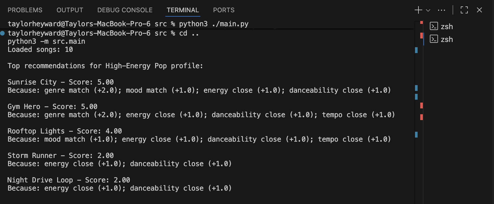
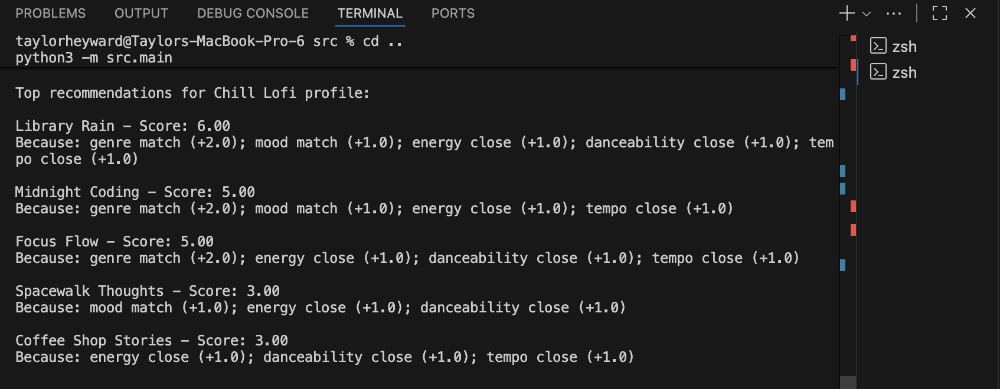
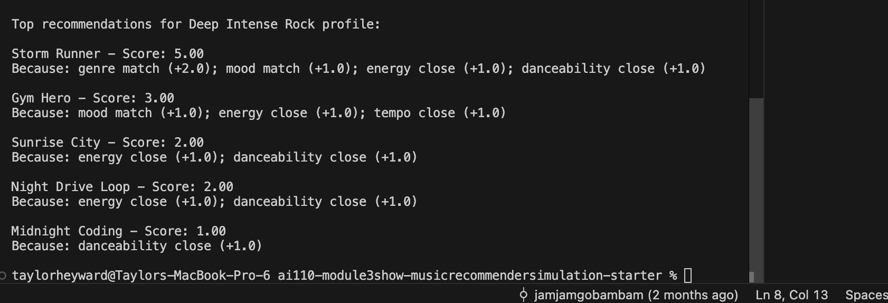
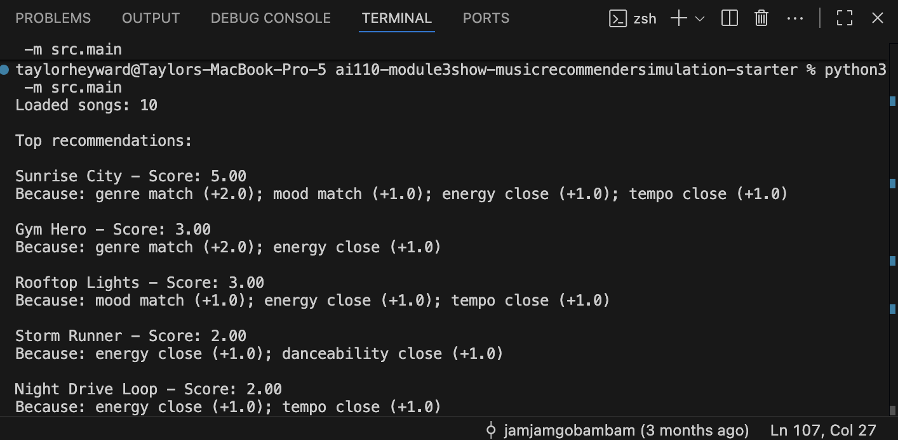

# Model Card: Music Recommender Simulation

## 1. Model Name

**VibeWave Groove Finder 1.0**
This name shows the goal: finding songs that match your vibe.

## 2. Intended Use

This recommender suggests songs based on what you like. It matches your favorite genre, mood, and how energetic you want the music to be. It is made for learning and classroom projects, not for real-world music apps.

## 3. How the Model Works

The model looks at each song’s genre, mood, energy, danceability, and tempo. It checks what the user likes for each of these. If a song matches the user’s favorite genre or mood, it gets points. If the song’s energy, danceability, or tempo are close to what the user wants, it gets more points. The songs with the most points are recommended. I changed the weights to see how much each feature matters.

## 4. Data

The dataset has 10 songs. Most are pop, lofi, or rock. There are happy, chill, and intense moods. I did not add or remove songs. Some genres and moods, like classical or sad, are missing, so the system can’t recommend those well.

## 5. Strengths

The system works well for users who like popular genres and common moods. It does a good job matching energy and danceability. When I tested it, the top songs usually made sense for the user’s profile.

## 6. Limitations and Bias

One key limitation of this recommender is that it can create "filter bubbles" by heavily favoring songs that match the most common genres or moods in the dataset. For example, since a large portion of the songs are pop, users with less common preferences (like classical or experimental genres) may rarely see relevant recommendations. The scoring logic also relies on a fixed energy gap, which may ignore users who prefer songs with very high or very low energy if those are underrepresented. Additionally, doubling the energy weight can cause the system to overlook other important features, such as mood or danceability, leading to less diverse results. These biases mean the system may not serve all user types equally well, especially those with niche or conflicting preferences.

## 7. Evaluation

For evaluation, I tested the recommender with several user profiles, including "High-Energy Pop," "Chill Lofi," and "Deep Intense Rock." I wanted to see if the system could give good recommendations for different tastes and not just repeat the same songs. One thing that surprised me was how often the song "Gym Hero" showed up, even for users who just wanted "Happy Pop." This happened because "Gym Hero" matched on energy and danceability, which had high weights in the scoring logic, even if it wasn't the best fit for mood or genre. It showed me that the system sometimes favors songs that are a close match on a few features, rather than picking the most obvious genre or mood match. This helped me realize the importance of balancing the weights for each feature.

## 8. Intended Use and Non-Intended Use

This system is for classroom learning and exploring how recommenders work. It is not for real music streaming or commercial use. It should not be used to make real-world music decisions or for users who need very specific recommendations.

## 9. Ideas for Improvement / Future Work

If I kept working on this, I would:
- Add more songs and more genres/moods to the dataset.
- Let users adjust the weights for each feature.
- Try new features, like lyrics or user listening history.
- Explain recommendations better, maybe by showing users why a song was picked.
- Work on making the top results more diverse, so users see more variety.
- Handle more complex user tastes, like people who like two very different genres.

## 10. Personal Reflection

My biggest learning moment was seeing how changing one number in the scoring logic could totally change the recommendations. Using AI tools helped me write code faster and fix bugs, but I always had to check if the suggestions made sense for my project. I was surprised that even a simple algorithm could make recommendations that felt personal. If I kept going, I would try to make the system smarter by learning from what users actually listen to. I learned that even simple rules can make a recommender feel smart. It was interesting to see how changing one number could change all the results. Using AI tools helped me get unstuck, but I always had to check if the answers made sense. Now I see why music apps sometimes repeat songs or miss my favorites—it's all about the data and the rules behind the scenes.
## Recommendation Results

This section presents the top recommendations generated by the music recommender system for three distinct user profiles. Each result demonstrates how the system tailors its suggestions based on user preferences for genre, mood, energy, danceability, and tempo. The screenshots below show the actual terminal output for each profile.

### High-Energy Pop

This profile seeks upbeat, energetic pop songs with high danceability and tempo.

### Chill Lofi

This profile prefers relaxed, chill lofi tracks with low energy and a slower tempo.

### Deep Intense Rock

This profile targets intense, high-energy rock songs with strong mood and rhythm.

## Example Output

Below is a sample terminal output showing the top recommendations for a default "pop/happy" profile:

This demonstrates how the recommender displays song titles, scores, and specific reasons for each recommendation.
# 🎵 Music Recommender Simulation

## Project Summary

In this project you will build and explain a small music recommender system.

Your goal is to:

- Represent songs and a user "taste profile" as data
- Design a scoring rule that turns that data into recommendations
- Evaluate what your system gets right and wrong
- Reflect on how this mirrors real world AI recommenders

Replace this paragraph with your own summary of what your version does.

---

## How The System Works

Real-world recommendation systems work by comparing user preferences to item features and assigning a score that reflects how well each item matches the user. These systems don’t just look for the highest values, but instead prioritize similarity. For example, a song is recommended not because it has the highest energy overall, but because its energy level is closest to what the user prefers. My system follows this same idea by using a scoring rule to evaluate how well each song matches the user across multiple features, and then a ranking rule to sort all songs from best to worst. My version prioritizes genre and mood first, since they strongly influence whether a user will like a song, and then refines recommendations using numerical features like energy, danceability, and tempo.

Features Used in the Simulation
Song object features:
genre (categorical)
mood (categorical)
energy (numerical, 0 to 1)
danceability (numerical, 0 to 1)
tempo (numerical, BPM)
UserProfile object features:
preferred genre
preferred mood
preferred energy level
preferred danceability level
preferred tempo

My system emphasizes similarity over magnitude, ensuring recommendations feel personalized rather than generic.

Algorithm Recipe

1. Genre Match: +2 points if the genre matches.
2. Mood Match: +1 point if the mood matches.
3. Energy Match: +1 point if the song’s energy is close (within 0.2) to the user’s target.
4. Danceability Match: +1 point if the song’s danceability is close (within 0.2) to the user’s target.
5. Tempo Match: +1 point if the song’s tempo is within ±10 BPM of the user’s target.

Songs are scored using these rules, then ranked. The top K recommendations are returned to the user.

Data Flow
User Preferences → Read songs.csv → For each song: Apply Scoring Logic → Assign Score → Collect Scores → Sort by Score → Top K Recommendations

Potential Biases
This system may favor genre and mood, but also rewards songs that are similar in energy, danceability, and tempo. It might overlook songs with unique qualities not captured by these features.
